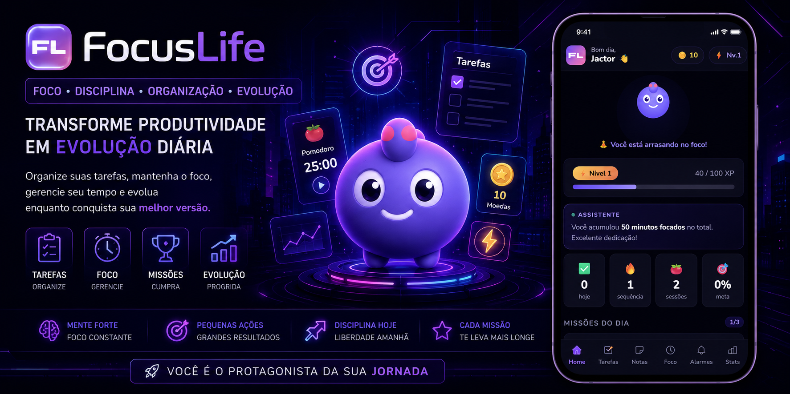

<p align="center">
  
</p>

# 🎯 FocusLife

> Transformando produtividade em uma experiência gamificada.

FocusLife é um aplicativo mobile focado em produtividade, organização pessoal e gerenciamento de tempo, desenvolvido para ajudar usuários a manterem consistência em suas rotinas através de mecânicas de gamificação, acompanhamento de tarefas e foco diário.

---

## 📱 Sobre o Projeto

O FocusLife nasceu com a proposta de unir ferramentas essenciais de produtividade em um único ambiente, incentivando o usuário a manter hábitos saudáveis e alcançar seus objetivos através de recompensas, progresso visual e interação gamificada.


---


<h2 align="center">📱 Preview do App</h2>

<table align="center">
<tr>
<td align="center">
<br>
<b>Home</b>
</td>

<td align="center">
<br>
<b>Foco</b>
</td>

<td align="center">
<br>
<b>Tarefas</b>
</td>
</tr>
</table>
---

## ✨ Funcionalidades

### 📝 Organização Pessoal
- Lista de tarefas dinâmica
- Bloco de notas
- Gerenciamento de objetivos
- Planejamento diário

### ⏱️ Gestão de Tempo
- Cronômetro
- Técnica Pomodoro
- Controle de foco
- Sessões de produtividade

### 🎮 Gamificação
- Sistema de progresso
- Experiência (XP)
- Evolução do usuário
- Recompensas por produtividade

### 🐾 Mascote Virtual
- Companheiro interativo
- Evolução baseada em desempenho
- Feedback visual motivacional

### 💰 Controle Financeiro
- Registro de receitas
- Controle de despesas
- Metas financeiras
- Visualização simplificada

---

## 🛠️ Tecnologias

- HTML5
- CSS3
- JavaScript
- PWA (Progressive Web App)
- Capacitor
- Android Studio
- Gradle

---

## 📂 Estrutura do Projeto

```text
FocusLife/
│
├── css/
├── js/
├── icons/
├── www/
├── android/
│
├── index.html
├── manifest.json
├── sw.js
├── capacitor.config.json
└── package.json
```

---

## 🚀 Executando Localmente

Clone o projeto:

```bash
git clone https://github.com/Joao-Dev-Web/FocusLife.git
```

Entre na pasta:

```bash
cd FocusLife
```

Instale as dependências:

```bash
npm install
```

Sincronize o Capacitor:

```bash
npx cap sync
```

Abra o Android Studio:

```bash
npx cap open android
```

---

## 📦 Gerando APK

Dentro da pasta android:

```bash
gradlew assembleDebug
```

APK gerado em:

```text
android/app/build/outputs/apk/debug/app-debug.apk
```

---

## 🎯 Roadmap

### ✅ Atual
- [x] Estrutura inicial do aplicativo
- [x] Conversão para Android com Capacitor
- [x] Interface principal
- [x] PWA configurada

### 🚧 Em Desenvolvimento
- [ ] Sistema completo de XP
- [ ] Loja de itens
- [ ] Sistema de níveis
- [ ] Conquistas
- [ ] Estatísticas avançadas
- [ ] Backup em nuvem
- [ ] Login de usuários

### 🔮 Futuro
- [ ] Multiplayer social
- [ ] Desafios semanais
- [ ] Ranking global
- [ ] IA para produtividade
- [ ] Integração com calendário

---

## 👨‍💻 Desenvolvedor

### João Victor Dias

Desenvolvedor Full Stack em formação com foco em:

- Desenvolvimento Web
- Aplicações Mobile
- Gamificação
- UX/UI
- Sistemas de Produtividade

GitHub:
https://github.com/Joao-Dev-Web

---

## 📄 Licença

Este projeto está sob a licença MIT.

---

⭐ Se gostou do projeto, considere deixar uma estrela no repositório.
